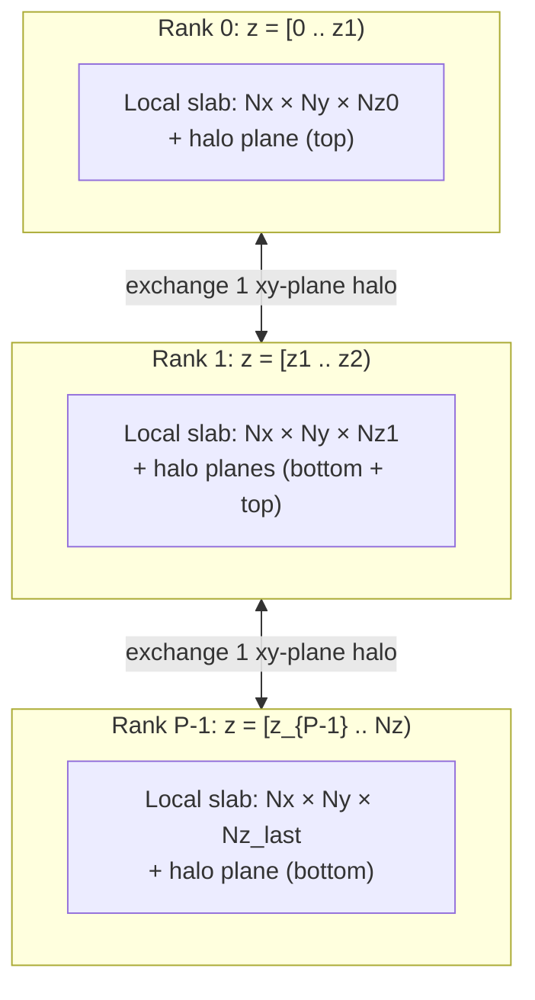
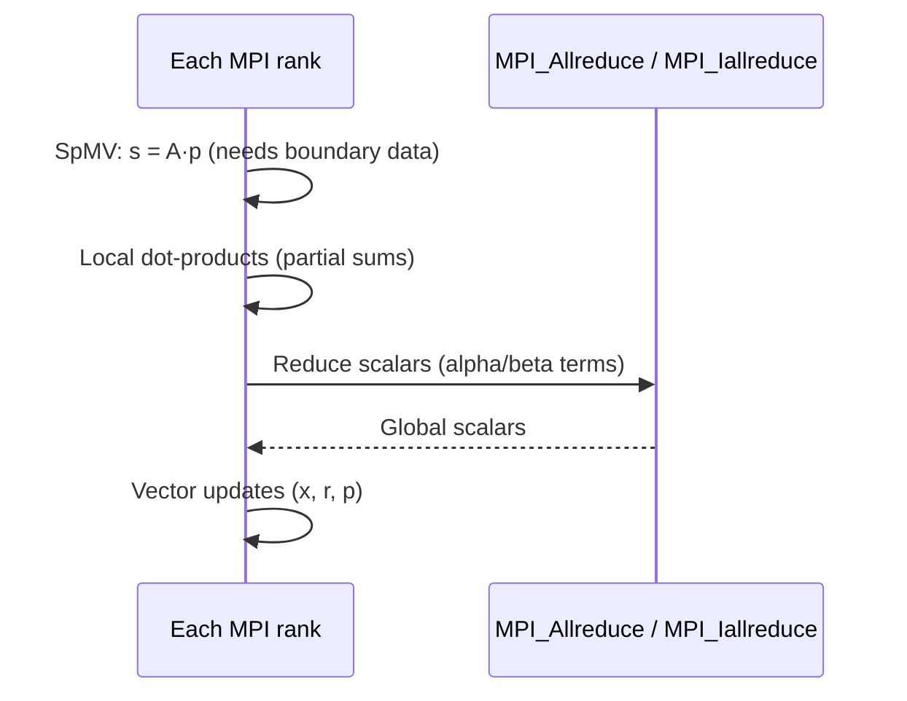
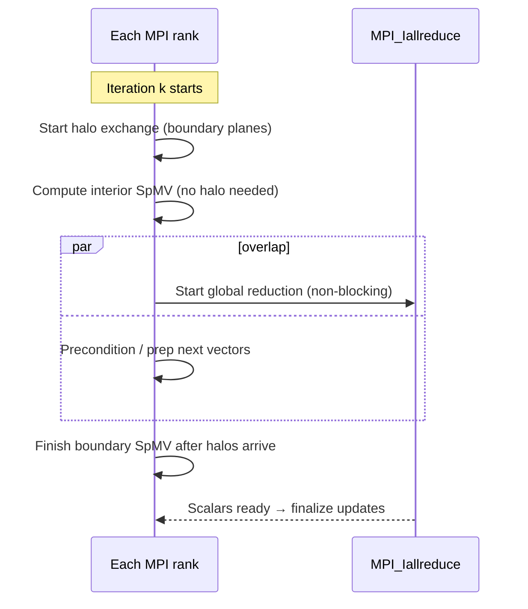

# Parallel Conjugate Gradient (MPI) — Jacobi-PCG & Pipelined Jacobi-PCG

This project implements and evaluates **two distributed-memory variants of the Conjugate Gradient method** for solving large **symmetric positive definite (SPD)** linear systems of the form **Ax = b**, where **A** comes from a structured **3D stencil discretization** (Poisson-like operator). 

The two solver variants share the same mathematical core (Jacobi preconditioning + CG), but differ in how they handle **communication and synchronization** at scale:

- **JCG (Jacobi-PCG / baseline)**: straightforward parallel PCG with **global replication of the search direction p** using `MPI_Allgatherv`, plus `MPI_Allreduce` for dot products.   
- **Pipelined JCG (PJCG / pipeline JCG)**: avoids global replication by using **z-slab halo exchange** (nearest-neighbor planes) and overlaps dot-product reductions using **non-blocking collectives** (e.g., `MPI_Iallreduce`). 

---

## Problem setup

### 3D grid and stencil operator
We benchmark synthetically generated sparse SPD matrices built from a structured 3D grid of size **Nx × Ny × Nz**. The main benchmarking configuration uses a **27-point stencil** (coupling each grid point to its 3×3×3 neighborhood). 

> Note: the codebase can also support a **7-point stencil** (face neighbors) for simpler validation/experiments (same parallel partitioning idea).

### Z-slab MPI decomposition (what changed vs “row partitioning”)
The distributed implementation uses a **1D domain decomposition along the z-axis** (**z-slab partitioning**). Each MPI rank owns a contiguous range of **xy-planes**:
- local subdomain: `Nx × Ny × Nz_local`
- local unknowns: `n_local = Nx · Ny · Nz_local`
- global offset: `row_start = z_start · (Nx · Ny)` 

This is the key point to communicate in the README/report: each process owns **a block of planes**, not “rows of the dense matrix”. The z-slab decomposition makes the communication pattern structured and scalable. 

---

## Data dependencies and communication (why you must communicate)

Inside each CG iteration there is an unavoidable dependency chain (you cannot parallelize iterations), so parallelism comes from splitting the work **within** an iteration. 

### Where communication is required
1) **SpMV** (`s = A·p`) needs neighbor values near subdomain boundaries.  
2) **Dot products / norms** (e.g., `pᵀ(Ap)`, `rᵀz`) require global reductions (synchronization).

### What each solver does

**Baseline JCG (global replication of p)**  
- `MPI_Allgatherv(p_local → p_global)` each iteration  
- local SpMV uses the gathered global vector  
- `MPI_Allreduce` for scalar products 

**Pipelined JCG (halo + overlap)**  
- exchange only boundary **xy-plane halos** with `rank-1` and `rank+1` (nearest neighbors in z)  
- split SpMV into:
  - *interior planes* (can be computed immediately)
  - *boundary planes* (computed after halos arrive)  
- use **non-blocking reductions** (e.g., `MPI_Iallreduce`) to overlap reduction latency with local work 

Communication volume intuition:
- baseline: **O(N³)** per-iteration traffic due to global replication
- pipelined: **O(N²)** per-iteration traffic (one or two halo planes per neighbor) 

---

## Architecture diagrams (README-friendly)

### 1) Z-slab partitioning + halo exchange


### 2) One iteration (baseline vs pipelined)


### 3) Pipelined idea (overlap)


---

## Implementation highlights

### CSR matrix construction (distributed setup)
Each rank **constructs its local CSR block directly** from `(Nx, Ny, Nz)` and its own `(z_start, Nz_local)` instead of building a global CSR on rank 0 and scattering it. This avoids expensive setup communication and scales better. 

### Correctness / validation trick
To validate correctness, we pick a known constant solution (e.g., `x_known = 2.0`) and construct the right-hand side as:
- `b_local = A_local · x_known`  
so the exact solution is known a priori for checks. 

---

## Build

> The project is intended to be built with an MPI compiler wrapper (e.g., `mpicc`).  
> The Makefile in this repo builds **two executables** (baseline vs pipelined) from the same source tree via a compile-time switch/flag. 

Typical usage (adapt to your exact Makefile targets):
```bash
make
# or
make baseline
make pipelined
```

---

## Run

> Parameters typically include grid size (Nx, Ny, Nz), maximum iterations, and tolerance. 

Examples (replace executable name/args with your real CLI):
```bash
mpirun -np 96 ./jcg_baseline 512 512 512 1e-10 5000
mpirun -np 96 ./jcg_pipelined 512 512 512 1e-10 5000
```

---

## Code structure (high-level)
The code is organized into modules that separate:
- **matrix construction** (local CSR build from z-slab geometry)
- **CSR kernels** (SpMV and vector utilities)
- **solvers**:
  - baseline JCG (Allgatherv + Allreduce)
  - pipelined JCG (halo exchange + Iallreduce overlap)
- **utilities** (timing, logging, validation, halo helpers) 

---

## OpenMP (planned / future work)
A natural extension is **hybrid MPI+OpenMP**: keep z-slab distribution across nodes, and parallelize local kernels (SpMV + vector loops) with OpenMP within each node. This can reduce the number of MPI ranks participating in collectives and often improves scalability on multi-core nodes. The current project reports MPI-only measurements; OpenMP is left as future work. 

---

## Reference
See the accompanying report for algorithm details, parallel design rationale, and performance results. 
